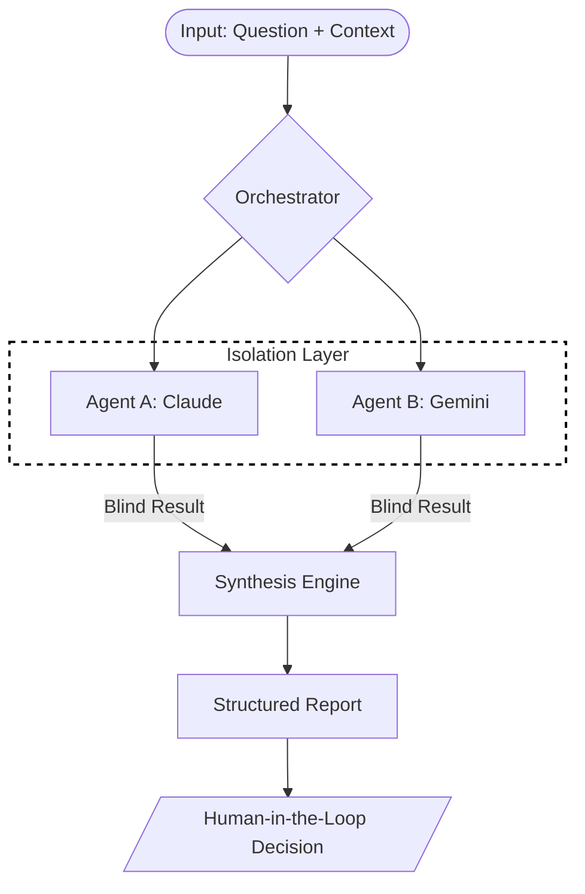

<div align="center">

# Peer-Consult

**Deterministic Multi-Agent Consultation Framework for High-Integrity Engineering**

[](https://github.com/AsaqeLee/peer-consult)
[](https://github.com/AsaqeLee/peer-consult)
[](https://github.com/AsaqeLee/peer-consult)

English | [简体中文](./docs/README_ZH.md)

</div>

---

## Introduction

**Peer-Consult** is a meta-engineering protocol designed to eliminate AI hallucination and architectural bottlenecks in high-stakes development. By orchestrating independent AI systems (Claude, Gemini) in a "blind" feedback loop, it ensures diverse technical perspectives and surfaces hidden edge cases before final decision-making.

>[!IMPORTANT]
>This framework is designed for senior engineers and autonomous agents who require deterministic, verified outputs rather than creative guesses.

---

## Workflow Architecture

The core orchestration engine enforces strict isolation between participating agents to maximize the integrity of the synthesis.



---

## Core Specifications

<details>
<summary><b>DDD Folder Structure</b></summary>

```text
peer-consult/
├── .codex/             # Skill definitions for autonomous environments
│   └── skills/         # Modular capabilities
├── scripts/            # Core orchestration & synthesis engine
├── docs/               # Context isolation & boundary definitions
│   └── peer_consult/   # Mandatory isolated context window
├── reference/          # Design philosophy and research
└── tests/              # Integrity verification suite
```
</details>

<details>
<summary><b>Conflict Resolution Protocol</b></summary>

When agents provide divergent solutions, the Synthesis Engine applies the following hierarchy:
1. **Security Baseline:** Any solution violating security boundaries is immediately flagged.
2. **Deterministic Match:** Overlapping logic between independent agents is prioritized as the "High-Integrity Core."
3. **Divergence Analysis:** Non-overlapping suggestions are categorized as "Alternative Perspectives" for human audit.
</details>

<details>
<summary><b>Enterprise Installation & Usage</b></summary>

### Prerequisites
- Python 3.10 or higher
- Environment variables: `ANTHROPIC_API_KEY`, `GOOGLE_API_KEY`

### Setup
```bash
git clone --recursive https://github.com/AsaqeLee/peer-consult.git
cd peer-consult
```

### Execution
```bash
python3 scripts/peer_consult.py \
  --question "Refactor Go service to use Repository pattern" \
  --context-file docs/peer_consult/request.md
```
</details>

<details>
<summary><b>FAQ</b></summary>

**Q: Why "blind" consultation?**
A: Standard AI interactions are linear. By preventing agents from seeing each other's intermediate thoughts, we maximize the diversity of technical solutions and surface hidden edge cases.

**Q: Is there any code-writing capability?**
A: No. By design, Peer-Consult is "Insight Only." It collects intelligence without directly modifying code, maintaining a strict human-in-the-loop requirement for implementation.
</details>

---

## Strategic Boundaries

- **Insight Only:** Collects intelligence without directly modifying code.
- **Context Isolated:** Only reads from `docs/peer_consult/` to prevent context leakage.
- **Deterministic:** Outputs are structured for immediate audit and ingestion.

---

<div align="center">

&copy; 2026 AsaqeLee. Designed for the era of multi-agent engineering.

</div>
