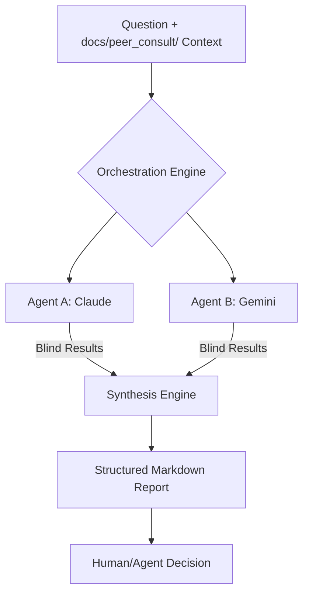

# Peer-Consult

> **Deterministic Multi-Agent Consultation Framework** for decentralized, blind AI peer reviews.

`peer-consult` is a meta-engineering tool designed to solve AI hallucination and architectural bottlenecks. It orchestrates multiple independent AI systems (Claude, Gemini) to provide "blind" feedback on a problem, ensuring diverse perspectives before a final human/agent decision.

## 📊 The Workflow



## 🧠 The Deterministic Positioning

### 1. Multi-Agent Blind Review
Standard AI interactions are linear. `peer-consult` enforces a parallel, blind consultation process. By preventing agents from seeing each other's intermediate thoughts, it maximizes the diversity of technical solutions and surfaces hidden edge cases.

### 2. Self-Healing JSON Schema
The framework utilizes structured input/output schemas to ensure deterministic integration with development environments (like Codex). It bridges the gap between the creative uncertainty of LLMs and the rigid requirements of software engineering.

### 3. Meta-Engineering for AI-Augmented Dev
This tool is the "AI-augmentation" engine used to build complex systems like [TaskFlow](https://github.com/AsaqeLee/taskflow). It serves as a proof-of-concept for how senior engineers can use multi-agent systems to accelerate code review, debugging, and system design.

## 🚀 Getting Started

### Prerequisites
- **Python 3.10+**
- **LLM Access:** Configured [Claude Code](https://github.com/anthropics/claude-code) and [Gemini CLI](https://github.com/google/generative-ai-python).
- **Git:** Submodules enabled for integrated skills.

### Environment Setup
Ensure your environment variables are configured for the respective providers:
```bash
export ANTHROPIC_API_KEY="your-key"
export GOOGLE_API_KEY="your-key"
```

### Installation
```bash
# Clone with submodules
git clone --recursive https://github.com/AsaqeLee/peer-consult.git
cd peer-consult

# Core run
python3 .codex/skills/peer-consult/scripts/peer_consult.py \
  --question "Refactor Go service to use Repository pattern" \
  --context-file docs/peer_consult/request.md
```

## 🛠 How it Works

- **Consultation:** Triggers `Claude Code` and `Gemini CLI` to analyze a specific question or context file.
- **Synthesis:** Aggregates independent pros/cons, candidate solutions, and risk assessments into a single Markdown summary.
- **Boundary Control:** Strict file-system boundaries and mandatory data desensitization ensure a "Security-First" workflow.

## ⚖️ Strategic Boundaries
- **Insight Only:** Collects intelligence without directly modifying code (human-in-the-loop).
- **Context Isolated:** Only reads from `docs/peer_consult/` to prevent context leakage.
- **Deterministic:** Outputs are structured for immediate audit and ingestion.

## 📂 Repository Structure
- `.codex/skills/`: Integrated Skill definition for Codex.
- `scripts/`: The core orchestration engine.
- `reference/`: Design philosophy and upstream research.