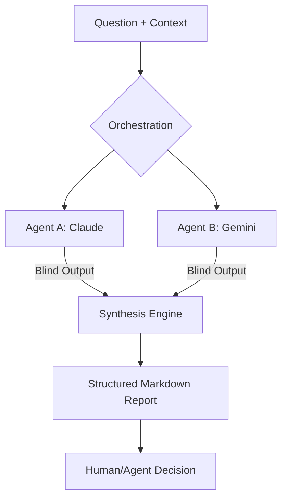

# peer-consult

> **Deterministic Multi-Agent Consultation Framework**  
> Decentralized, blind AI peer reviews for high-stakes engineering.

---

`peer-consult` is a meta-engineering protocol designed to eliminate AI hallucination and architectural bottlenecks. By orchestrating independent AI systems in a "blind" feedback loop, it ensures diverse technical perspectives and surfaces hidden edge cases before final decision-making.

## Core Philosophy

### Multi-Agent Blind Review
Standard AI workflows are linear and prone to bias. `peer-consult` enforces parallel, isolated consultation, preventing agents from influencing each other's intermediate logic to maximize the integrity of technical solutions.

### Self-Healing Determinism
Utilizing structured input/output schemas, the framework bridges the gap between the creative uncertainty of LLMs and the rigid requirements of production software engineering.

### Context Isolation
A security-first approach that maintains strict file-system boundaries. The engine only operates within defined context windows to prevent data leakage and ensure privacy.

---

## The Workflow



---

## Getting Started

### Prerequisites
- **Python 3.10+**
- **LLM Access:** Configured [Claude Code](https://github.com/anthropics/claude-code) and [Gemini CLI](https://github.com/google/generative-ai-python).

### Installation
```bash
# Clone with submodules
git clone --recursive https://github.com/AsaqeLee/peer-consult.git
cd peer-consult

# Execute consultation
python3 scripts/peer_consult.py \
  --question "Refactor Go service to use Repository pattern" \
  --context-file docs/peer_consult/request.md
```

## Structure
- `scripts/`: Core orchestration engine.
- `docs/`: Design philosophy and context isolation boundaries.
- `.codex/`: Integrated Skill definitions for autonomous environments.

---

&copy; 2026 AsaqeLee. Built for high-integrity engineering.
