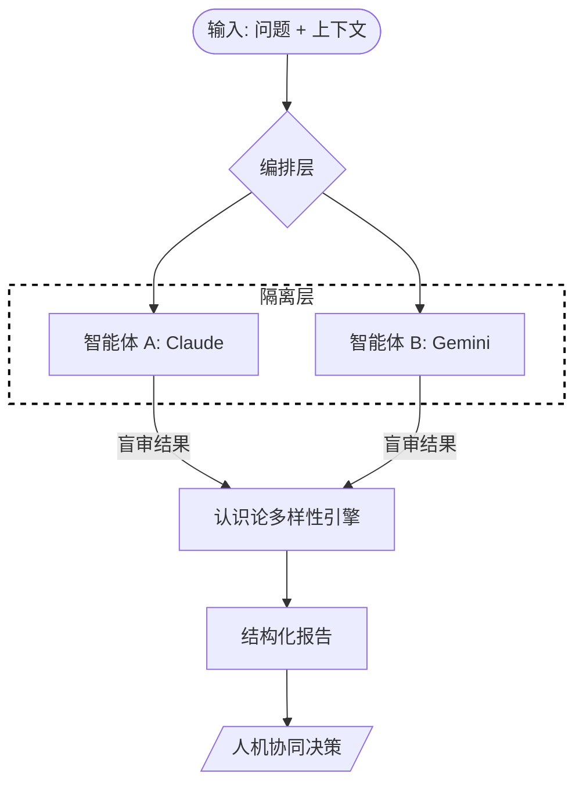

<div align="center">

# Peer-Consult

**面向高可靠工程的确定性多智能体咨询框架**

[](https://github.com/AsaqeLee/peer-consult)
[](https://github.com/AsaqeLee/peer-consult)
[](https://github.com/AsaqeLee/peer-consult)

[English](./README.md) | 简体中文

</div>

---

## 项目简介

**Peer-Consult** 是一种元工程协议（Meta-Engineering Protocol），旨在消除高风险开发中的 AI 幻觉和架构瓶颈。通过在“盲审”反馈循环中编排独立的 AI 系统（如 Claude、Gemini），该框架能确保技术视角的多样性，并在最终决策前发现潜在的边界案例。

>[!IMPORTANT]
>本框架专为资深工程师和自主智能体设计，追求确定性、经过验证的输出，而非创造性的猜测。

---

## 架构工作流

核心编排层（Consensus-Driven Agentic Orchestration）对参与的智能体实施严格隔离，以最大限度地保证合成结果的完整性。



---

## 核心规范

<details>
<summary><b>领域驱动设计 (DDD) 目录结构</b></summary>

```text
peer-consult/
├── .codex/             # 自主环境的 Skill 定义
│   └── skills/         # 模块化能力
├── scripts/            # 核心编排与合成引擎
├── docs/               # 上下文隔离与边界定义
│   └── peer_consult/   # 强制隔离的上下文窗口
├── reference/          # 设计哲学与研究
└── tests/              # 完整性验证测试集
```
</details>

<details>
<summary><b>冲突裁决协议 (Conflict Resolution Protocol)</b></summary>

当智能体提供分歧方案时，合成引擎将应用以下优先级：
1. **安全基线：** 任何违反安全边界的方案将被立即标记。
2. **确定性匹配：** 独立智能体之间的重叠逻辑被优先视为“高完整性核心”。
3. **分歧分析：** 非重叠建议被归类为“备选视角”，供人工审计。
</details>

<details>
<summary><b>企业级安装与使用</b></summary>

### 前置条件
- Python 3.10 或更高版本
- 环境变量：`ANTHROPIC_API_KEY`, `GOOGLE_API_KEY`

### 设置
```bash
git clone --recursive https://github.com/AsaqeLee/peer-consult.git
cd peer-consult
```

### 执行
```bash
python3 scripts/peer_consult.py \
  --question "重构 Go 服务以使用 Repository 模式" \
  --context-file docs/peer_consult/request.md
```
</details>

<details>
<summary><b>常见问题 (FAQ)</b></summary>

**Q: 为什么要进行“盲审”咨询？**
A: 标准的 AI 交互是线性的。通过防止智能体看到彼此的中间思考过程，我们能最大限度地发挥技术方案的多样性，并发现隐藏的边界案例。

**Q: 该工具具备代码编写能力吗？**
A: 不具备。根据设计，Peer-Consult 仅提供“洞察（Insight Only）”。它只负责收集情报而不直接修改代码，在实施阶段保持严格的人在回路（Human-in-the-loop）要求。
</details>

---

## 策略边界

- **仅限洞察：** 收集智能分析而不直接修改代码。
- **上下文隔离：** 仅从 `docs/peer_consult/` 读取数据，防止上下文泄漏。
- **Schema 强约束确定性：** 输出结果经过结构化处理，便于立即审计和接入。

---

<div align="center">

&copy; 2026 AsaqeLee. 为多智能体工程时代而设计。

</div>
